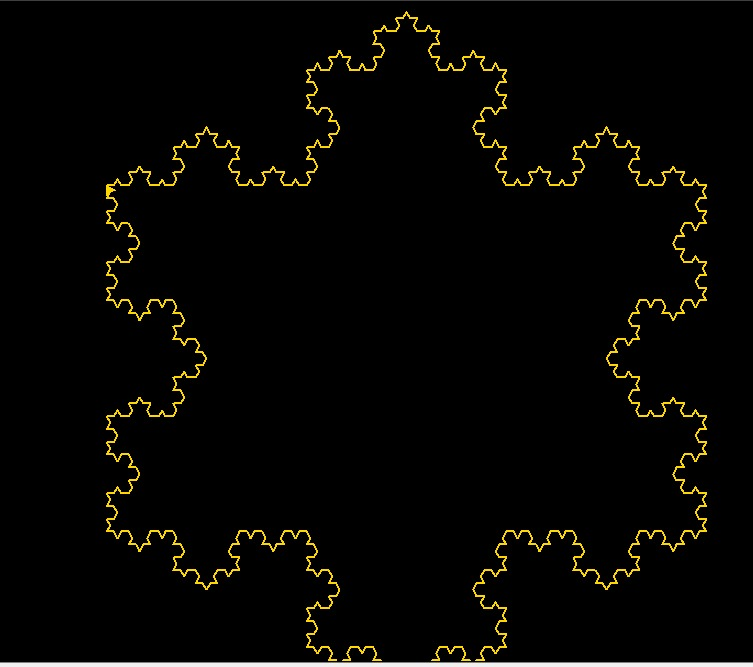
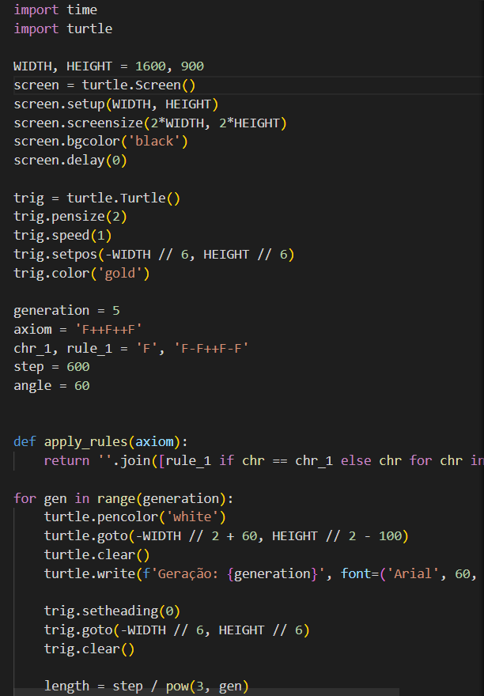
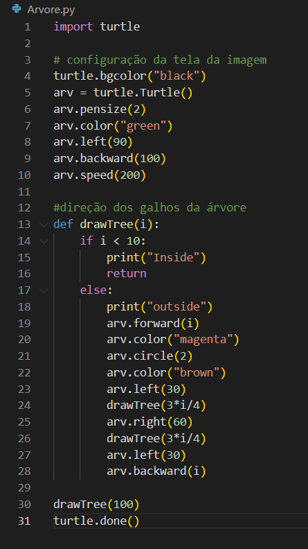

# Trabalho Factal

<h1>Aula de Computação Gráfica e Tecnologias Imersivas</h1>

 >O que é um Fractal?

Fractais são objetos em que cada parte é semelhante ao objeto como um todo. Isso significa que os padrões da figura inteira são repetidos em cada parte, só que numa escala de tamanho menor. 

Os flocos de neve são exemplos de fractais: cada ramo do floco parece com o floco inteiro.

### Código fractal de uma árvore
----------------------

####  Meu Factal 
----------------------
Com o conhecimento adquirido em sala de aula foi possível fazer um fractal em formato circular e continuo.

----------------------
